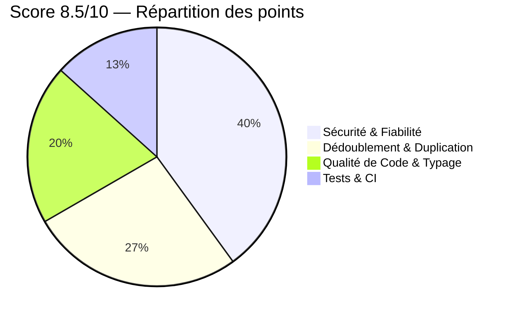
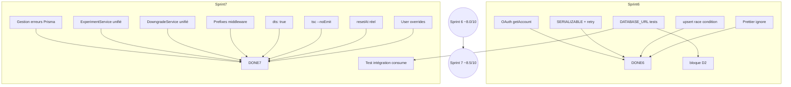

# Plan d'Attaque 8.5/10 — Sprint 6 & 7

> **Contexte** : Architecture notée ~7/10 après Sprint 5. Reste ~1.5 point à gagner pour atteindre le seuil 8.5/10.  
> Ce document détaille les chantiers par bloc, avec priorité, effort estimé et critères de succès.

---

## Table des Matières

1. [Vue d'ensemble — Où sont les points perdus ?](#1-vue-densemble)
2. [Bloc A — Sécurité & Fiabilité (🔴 prioritaire, ~0.6 pt)](#2-bloc-a)
3. [Bloc B — Dédoublement & Duplication (~0.4 pt)](#3-bloc-b)
4. [Bloc C — Qualité de Code & Typage (~0.3 pt)](#4-bloc-c)
5. [Bloc D — Tests & CI (~0.2 pt)](#5-bloc-d)
6. [Roadmap — Par sprint](#6-roadmap)

---

## 1. Vue d'ensemble — Où sont les points perdus ?



| Bloc                               | Perte   | Priorité       |
| ---------------------------------- | ------- | -------------- |
| **A — Sécurité & Fiabilité**       | −0.6 pt | 🔴 Immédiat    |
| **B — Dédoublement & Duplication** | −0.4 pt | 🟠 Court terme |
| **C — Qualité de Code & Typage**   | −0.3 pt | 🟡 Moyen terme |
| **D — Tests & CI**                 | −0.2 pt | 🔵 Continu     |

---

## 2. Bloc A — Sécurité & Fiabilité (−0.6 pt)

> Objectif : Passer de vulnérabilités documentées (WARN) à zéro exception.

### A1 — OAuth Encryption : wrapper `getAccount`

**Fichier** : `omnysync-web/src/lib/auth/adapter-encryption.ts`

**Problème** : Le wrapper `withOAuthEncryption` intercepte `linkAccount` (chiffre) et `getUserByAccount` (déchiffre — à tort, car ça retourne un `User` pas un `Account`). **`getAccount` n'est pas intercepté**. Si du code lit un compte via `getAccount()`, les tokens sont retournés chiffrés.

**Fix** :

```typescript
async getAccount(providerAccountId, provider) {
  const account = await adapter.getAccount!(providerAccountId, provider);
  if (account) decryptResult(account);
  return account;
}
```

**Supprimer** l'interception inutile de `getUserByAccount` (qui agit sur un `User`, pas un `Account`, donc `decryptResult` est un no-op).

**Effort** : ~15 min  
**Critère de succès** : `getAccount` retourne des tokens déchiffrés ; plus d'appel à `decryptResult` sur `User`.

### A2 — Atomicité réelle de `consumeUsage` : `SERIALIZABLE` isolation

**Fichier** : `packages/omnysync-core/src/entitlements/EntitlementRepository.ts`

**Problème** : La transaction `prisma.$transaction()` utilise l'isolation par défaut PostgreSQL (`READ COMMITTED`). Deux transactions concurrentes peuvent :

1. Lire `currentUsage = 45` (limite = 50)
2. Passer le check `45 + 10 <= 50`
3. Toutes deux UPDATE → `usageCount = 65` au lieu de 55

**Fix** :

```typescript
return prisma.$transaction(
  async (tx) => {
    const existing = await tx.usageTracking.findUnique({ ... });
    // ... check et update ...
  },
  { isolationLevel: 'Serializable' },
);
```

**⚠️ Effet de bord** : Les conflits de sérialisation doivent être catchés et retry. Ajouter un mécanisme de retry (3 tentatives max avec backoff exponentiel).

```typescript
async consumeUsage(orgId: string, featureKey: string, amount: number, limit: number | null): Promise<ConsumeUsageResult> {
  if (limit === null) {
    // Cas illimité — toujours simple upsert
    return this.consumeUsageUnlimited(orgId, featureKey, amount);
  }
  return this.consumeUsageWithRetry(orgId, featureKey, amount, limit);
}

private async consumeUsageWithRetry(orgId: string, featureKey: string, amount: number, limit: number, retries = 3): Promise<ConsumeUsageResult> {
  try {
    return await this.prisma.$transaction(async (tx) => {
      const existing = await tx.usageTracking.findUnique({ where: { orgId_featureKey: { orgId, featureKey } } });
      const currentUsage = existing?.usageCount ?? 0;
      if (currentUsage + amount > limit) {
        return { success: false, newUsageCount: currentUsage, limitReached: true };
      }
      // upsert atomique
      const updated = await tx.usageTracking.upsert({
        where: { orgId_featureKey: { orgId, featureKey } },
        create: { orgId, featureKey, usageCount: amount },
        update: { usageCount: { increment: amount } },
      });
      return { success: true, newUsageCount: updated.usageCount, limitReached: false };
    }, { isolationLevel: 'Serializable' });
  } catch (error) {
    if (isSerializationError(error) && retries > 0) {
      await delay(50 * (4 - retries)); // backoff : 50ms, 100ms, 150ms
      return this.consumeUsageWithRetry(orgId, featureKey, amount, limit, retries - 1);
    }
    throw error;
  }
}
```

**Fonction utilitaire** :

```typescript
function isSerializationError(error: unknown): boolean {
  return (
    error instanceof Prisma.PrismaClientKnownRequestError &&
    error.code === "P2034"
  ); // PostgreSQL serialization failure
}
```

**Effort** : ~2h  
**Critère de succès** : Test unitaire qui lance 10 `consume` concurrents et vérifie que le total ne dépasse jamais `limit`. **Test d'intégration** avec une vraie base PostgreSQL.

### A3 — Race condition sur l'insertion initiale (`upsert`)

**Fichier** : `packages/omnysync-core/src/entitlements/EntitlementRepository.ts`

**Problème** : Le code fait `findUnique` puis `create` en deux temps. En cas d'appels concurrents, le second `create` échoue avec `P2002` (unique constraint).

**Fix** : Remplacer le pattern `findUnique → create` par un `upsert` :

```typescript
const updated = await tx.usageTracking.upsert({
  where: { orgId_featureKey: { orgId, featureKey } },
  create: { orgId, featureKey, usageCount: amount },
  update: { usageCount: { increment: amount } },
});
```

**Effort** : ~30 min  
**Critère de succès** : Pas de test qui échoue avec `P2002`.

### A4 — Gestion des erreurs Prisma dans les services

**Problème** : Les services qui appellent `prisma.account.create()` (via l'adapter) ou d'autres opérations Prisma ne gèrent pas les erreurs de connexion ou de contrainte. Si la base est temporairement indisponible, l'utilisateur reçoit une erreur 500 non formatée.

**Fix** : Ajouter un middleware Prisma (cette fois via `$extends`, l'API moderne de Prisma 7 qui remplace `$use`) ou un wrapper de service qui catch les `PrismaClientKnownRequestError` et les transforme en erreurs métier.

```typescript
// packages/omnysync-core/src/prisma/error-handler.ts
import { Prisma } from "@prisma/client";

export function handlePrismaError(error: unknown): never {
  if (error instanceof Prisma.PrismaClientKnownRequestError) {
    switch (error.code) {
      case "P2002":
        throw new ConflictError("Resource already exists");
      case "P2025":
        throw new NotFoundError("Resource not found");
      case "P2034":
        throw new ConcurrencyError("Concurrent modification, retry");
      default:
        throw new DatabaseError("Database operation failed");
    }
  }
  throw error;
}
```

**Effort** : ~1h  
**Critère de succès** : `PrismaClientKnownRequestError` est systématiquement catché et transformé dans tous les services.

---

## 3. Bloc B — Dédoublement & Duplication (−0.4 pt)

> Objectif : Zéro fichier dupliqué entre core et web.

### B1 — ExperimentService unifié

**Fichiers** :

- `packages/omnysync-core/src/entitlements/ExperimentService.ts` (312 lignes)
- `omnysync-web/src/lib/entitlements/ExperimentService.ts` (307 lignes)

**État** : Deux fichiers quasi identiques (5 lignes de différence). Le core a une signature légèrement différente, le web a des imports différents.

**Fix** : Prendre la version core comme source unique, remplacer le web par `export * from '@omnysync/core/entitlements/ExperimentService'`.

**Risque** : Vérifier que le web n'utilise pas une méthode qui n'existe pas dans le core.

**Effort** : ~30 min  
**Critère de succès** : Les tests qui utilisent `ExperimentService` passent (core + web).

### B2 — DowngradeService unifié

**Fichiers** :

- `packages/omnysync-core/src/entitlements/DowngradeService.ts` (250 lignes)
- `omnysync-web/src/lib/entitlements/DowngradeService.ts` (231 lignes)

**État** : Deux fichiers divergés. Le web a plus de méthodes (méthodes de notification, `applyDowngrade` avec email).

**Fix** : Analyser les différences — si les méthodes web sont des wrappers Next.js (email, etc.), les garder dans le web mais faire hériter du core. Si ce sont des méthodes universelles, les fusionner dans le core.

**Approche recommandée** :

1. Copier la version web (plus complète) dans le core
2. Remplacer la version web par `export *` du core
3. Les dépendances Next.js (email, auth) deviennent des callbacks injectés

**Effort** : ~1h  
**Critère de succès** : Tous les tests DowngradeService passent.

### B3 — EntitlementRepository web (dernière vérification)

**Fichiers** :

- `omnysync-web/src/lib/entitlements/EntitlementRepository.ts`

**État** : Normalement déjà converti en `export *` dans le correctif post-merge (Sprint 4 fix). **Vérifier que c'est bien le cas** et qu'il n'y a pas de résidu.

**Effort** : ~5 min  
**Critère de succès** : Le fichier fait 1 ligne, pas 836.

### B4 — Middleware core vs web (conflit de noms)

**Fichiers** :

- `packages/omnysync-core/src/entitlements/middleware.ts` (framework-agnostic)
- `omnysync-web/src/lib/entitlements/middleware-factories.ts` (Next.js)

**État** : Sprint 5 a renommé + ajouté un barrel. Les deux versions coexistent avec les mêmes noms de fonction.

**Fix** : Pour éviter toute confusion, **préfixer les fonctions du core** (ex: `createOrgIdResolver` → `createPureOrgIdResolver`) ou celles du web (ex: `createWebOrgIdResolver`). La meilleure approche : ajouter un suffixe `Web` aux fonctions du web uniquement :

```typescript
// middleware-factories.ts
export function createWebOrgIdResolver(): OrgIdResolver { ... }
export function requireWebFeature(featureKey: string, orgIdResolver?: OrgIdResolver): MiddlewareHandler { ... }
```

Et mettre à jour le barrel de compatibilité :

```typescript
export {
  createWebOrgIdResolver as createOrgIdResolver, // alias pour backward compat
  requireWebFeature as requireFeature,
  // ...
} from "./middleware-factories";
```

**Effort** : ~45 min  
**Critère de succès** : Impossible d'importer accidentellement la mauvaise version.

---

## 4. Bloc C — Qualité de Code & Typage (−0.3 pt)

> Objectif : tsc --noEmit passe, dts généré, code mort supprimé.

### C1 — Génération des `.d.ts` (tsup)

**Fichier** : `packages/omnysync-core/tsup.config.ts`

**Problème** : `dts: false` dans la config tsup. Les consommateurs TypeScript du package n'ont pas d'auto-complete ni de vérification de type.

**Fix** : Passer `dts: true` dans `tsup.config.ts`.

**Risque** : Les déclarations Prisma peuvent causer des erreurs si le générateur Prisma n'est pas exécuté avant le build.

```typescript
export default defineConfig({
  entry: ["src/**/*.ts"],
  dts: true, // ← activer
  // ...
});
```

**⚠️ Prérequis** : `prisma generate` doit être exécuté avant tsup (dans le script `build`).

```json
// package.json
{
  "scripts": {
    "build": "prisma generate && tsup",
    "dev": "tsup --watch"
  }
}
```

**Effort** : ~30 min  
**Critère de succès** : `node_modules/@omnysync/core/**/*.d.ts` existe et est importable par les consommateurs.

### C2 — Résoudre le crash `tsc --noEmit`

**Problème** : `npx tsc --noEmit` dans le core plante avec un stack overflow du type checker sur `node_modules/@prisma/client` ou `node_modules/next`. Problème connu avec TypeScript 6.0+ et Prisma 7.

**Fix** :

1. Ajouter `skipLibCheck: true` dans `tsconfig.json` du core
2. Vérifier que les fichiers source `.ts` passent sans erreur
3. Si le crash persiste, essayer `"moduleResolution": "bundler"` au lieu de `"node16"`

```json
{
  "compilerOptions": {
    "skipLibCheck": true,
    "moduleResolution": "bundler"
    // ...
  }
}
```

**Effort** : ~30 min  
**Critère de succès** : `tsc --noEmit` passe en < 10s sans crash.

### C3 — `resetAt: {}` — vraies dates de reset

**Fichier** : `packages/omnysync-core/src/entitlements/FeatureGateService.ts`

**Problème** : `toEntitlementsResponse()` retourne `resetAt: {}` (objet vide) alors que le type attend `Record<string, string>` ou `Record<string, Date>`. Aucune feature n'a de date de reset renseignée.

**Fix** : Calculer la date de reset pour chaque feature limitée :

```typescript
private toEntitlementsResponse(map: EntitlementMap, usage: Record<string, number>): EntitlementsResponse {
  const resetAt: Record<string, string> = {};
  for (const featureKey of Object.keys(map.limits)) {
    resetAt[featureKey] = this.getNextResetDate().toISOString();
  }
  return {
    plan: map.planKey,
    features: map.features,
    limits: map.limits,
    usage,
    resetAt,
  };
}
```

**Effort** : ~15 min  
**Critère de succès** : `resetAt` contient une date pour chaque feature avec limite.

### C4 — User overrides (« skipping for now »)

**Fichier** : `packages/omnysync-core/src/entitlements/FeatureGateService.ts`

**Problème** : Commentaire ligne 300 : « user override would need userId passed in — skipping for now ». Tech debt documentée depuis Sprint 4.

**Fix** : Implémenter le passage de `userId` dans la chaîne d'appel :

1. Ajouter `userId?: string` optionnel à `hasFeature`, `canConsume`, `consume`, `getLimit`, etc.
2. Dans `resolveFeatureValue`, si `userId` est fourni, appeler `this.repo.getUserOverride(userId, featureKey)`
3. Appliquer la résolution : user override > org override > plan

```typescript
async hasFeature(orgId: string, featureKey: string, userId?: string): Promise<boolean> {
  const resolved = await this.resolveFeatureValue(orgId, featureKey, 'BOOLEAN', userId);
  return resolved.value as boolean;
}

private async resolveFeatureValue(
  orgId: string,
  featureKey: string,
  featureType: FeatureType,
  userId?: string, // NOUVEAU
): Promise<ResolvedFeature> {
  // ...
  // 1. User override (si userId fourni)
  if (userId) { ... }
  // 2. Org override
  // 3. Plan
}
```

**Effort** : ~2h  
**Critère de succès** : Un utilisateur avec un override peut avoir accès à une feature que son organisation n'a pas.

---

## 5. Bloc D — Tests & CI (−0.2 pt)

> Objectif : Zéro test cassé (sauf contrainte externe documentée), CI verte.

### D1 — `DATABASE_URL` dans l'environnement de test

**Problème** : 23+ tests web échouent car `DATABASE_URL` n'est pas défini. Le lazy loading de Prisma évite le crash à l'import, mais les tests qui appellent réellement Prisma (services) plantent.

**Fix optionnel 1 (recommandé)** : Configurer un environnement de test avec SQLite :

```json
// omnysync-web/.env.test
DATABASE_URL="file:./test.db"
```

Et modifier les scripts de test :

```json
// package.json
{
  "scripts": {
    "test": "dotenv -e .env.test -- vitest run"
  }
}
```

**Fix optionnel 2 (workaround)** : Mocker `@omnysync/core/prisma` dans les tests qui n'ont pas besoin de vraie DB :

```typescript
vi.mock("@omnysync/core/prisma", () => ({
  getPrisma: () => prismaMock,
  prisma: prismaMock,
}));
```

**Effort** : 2-4h  
**Critère de succès** : `npm test` dans le web donne <10 échecs (uniquement les tests qui appellent des APIs externes).

### D2 — Test d'intégration pour `consumeUsage`

**Problème** : Le comportement atomique de `consumeUsage` (transaction Prisma + isolation SERIALIZABLE) n'est testé qu'avec des mocks. La vraie logique Prisma (upsert, rollback) n'est pas couverte.

**Fix** : Ajouter un test d'intégration dans `packages/omnysync-core/prisma/__tests__/` qui utilise une vraie base PostgreSQL (ou SQLite via `@prisma/adapter-libsql`). Ce test lance N appels concurrents et vérifie que `usageCount` ne dépasse jamais `limit`.

```typescript
it("should enforce limit atomically under concurrent load", async () => {
  const LIMIT = 5;
  const CONCURRENCY = 10;

  // Préparer l'état
  await prisma.usageTracking.create({
    data: {
      orgId: "test-org",
      featureKey: "test-feature",
      usageCount: 0,
      periodStart: new Date(),
      periodEnd: new Date(),
    },
  });

  // Lancer 10 appels concurrents
  const results = await Promise.allSettled(
    Array.from({ length: CONCURRENCY }, () =>
      repo.consumeUsage("test-org", "test-feature", 1, LIMIT),
    ),
  );

  // Vérifier que le total ne dépasse jamais LIMIT
  const successCount = results.filter(
    (r) => r.status === "fulfilled" && r.value.success,
  ).length;
  expect(successCount).toBeLessThanOrEqual(LIMIT);
});
```

**Effort** : ~2h (inclut setup DB de test)  
**Critère de succès** : Test flaky-proof qui passe à 100% des runs.

### D3 — CI Pipeline amélioré

**Problème** : Les hooks pre-push lancent `pnpm run check` qui échoue systématiquement (Prettier sur les fichiers YAML). Résultat : tout le monde utilise `--no-verify`.

**Fix** :

1. **Prettier** : Ajouter un `.prettierignore` pour exclure les fichiers YAML, config, et lock :

```
.github/
*.yml
*.yaml
pnpm-lock.yaml
docker-compose.yml
```

2. **Lint-staged** : Ne lancer Prettier que sur les fichiers stagés (déjà configuré, mais le hook pre-push lance `pnpm run check` sur tout le repo)

**Effort** : ~30 min  
**Critère de succès** : `git push` sans `--no-verify` passe (ou échoue uniquement pour de vraies erreurs).

---

## 6. Roadmap — Par sprint

### Sprint 6 (Objectif : ~8.0/10)

| #   | Tâche                                                          | Bloc | Effort    | Priorité |
| --- | -------------------------------------------------------------- | ---- | --------- | -------- |
| 1   | OAuth : wrapper `getAccount` + retirer faux `getUserByAccount` | A1   | 15 min    | 🔴       |
| 2   | Atomicité : `SERIALIZABLE` + retry                             | A2   | 2h        | 🔴       |
| 3   | Race condition : `upsert`                                      | A3   | 30 min    | 🔴       |
| 4   | `dotenv` + mocks pour DATABASE_URL                             | D1   | 3h        | 🟠       |
| 5   | Prettier ignore + CI fix                                       | D3   | 30 min    | 🟠       |
|     | **Total Sprint 6**                                             |      | **~6.5h** |          |

### Sprint 7 (Objectif : ~8.5/10)

| #   | Tâche                         | Bloc | Effort    | Priorité |
| --- | ----------------------------- | ---- | --------- | -------- |
| 6   | ExperimentService unifié      | B1   | 30 min    | 🟠       |
| 7   | DowngradeService unifié       | B2   | 1h        | 🟠       |
| 8   | Prefixes middleware           | B4   | 45 min    | 🟠       |
| 9   | `dts: true` dans tsup         | C1   | 30 min    | 🟡       |
| 10  | `tsc --noEmit`                | C2   | 30 min    | 🟡       |
| 11  | `resetAt` réel                | C3   | 15 min    | 🟡       |
| 12  | User overrides implémentés    | C4   | 2h        | 🟡       |
| 13  | Gestion erreurs Prisma        | A4   | 1h        | 🟡       |
| 14  | Test intégration consumeUsage | D2   | 2h        | 🔵       |
|     | **Total Sprint 7**            |      | **~8.5h** |          |

### Diagramme de dépendances



---

## Annexe — Fichiers à modifier (checklist complète)

### Sprint 6

- [ ] `omnysync-web/src/lib/auth/adapter-encryption.ts` — wrapper `getAccount`, retirer `getUserByAccount`
- [ ] `packages/omnysync-core/src/entitlements/EntitlementRepository.ts` — `SERIALIZABLE`, retry, `upsert`
- [ ] `packages/omnysync-core/src/entitlements/FeatureGateService.ts` — (inchangé, le service passe juste le paramètre)
- [ ] `omnysync-web/.env.test` — créer avec `DATABASE_URL`
- [ ] `.prettierignore` — exclure `.github/`, `*.yml`, `*.yaml`, `pnpm-lock.yaml`

### Sprint 7

- [ ] `packages/omnysync-core/src/entitlements/ExperimentService.ts` — inchangé (source)
- [ ] `omnysync-web/src/lib/entitlements/ExperimentService.ts` → `export * from '@omnysync/core/entitlements/ExperimentService'`
- [ ] `packages/omnysync-core/src/entitlements/DowngradeService.ts` — fusion web → core
- [ ] `omnysync-web/src/lib/entitlements/DowngradeService.ts` → `export *` du core
- [ ] `omnysync-web/src/lib/entitlements/middleware-factories.ts` — préfixer + barrel
- [ ] `packages/omnysync-core/tsup.config.ts` — `dts: true`
- [ ] `packages/omnysync-core/package.json` — `build` script avec `prisma generate && tsup`
- [ ] `packages/omnysync-core/tsconfig.json` — `skipLibCheck`, `moduleResolution: "bundler"`
- [ ] `packages/omnysync-core/src/entitlements/FeatureGateService.ts` — `resetAt`, `userId`
- [ ] `packages/omnysync-core/src/prisma/error-handler.ts` — créer
- [ ] `packages/omnysync-core/src/prisma/__tests__/consume-usage.integration.test.ts` — créer

---

> **Note** : Le score 8.5/10 est atteignable en ~15h de travail réparties sur 2 sprints.  
> Au-delà de 8.5, les gains deviennent marginaux (<0.1 pt par tâche) et la priorité doit être réévaluée.
